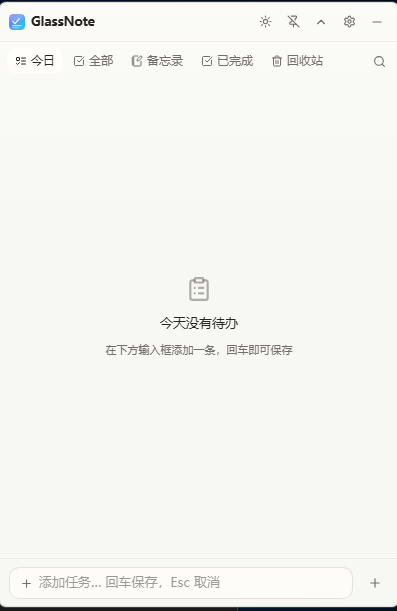
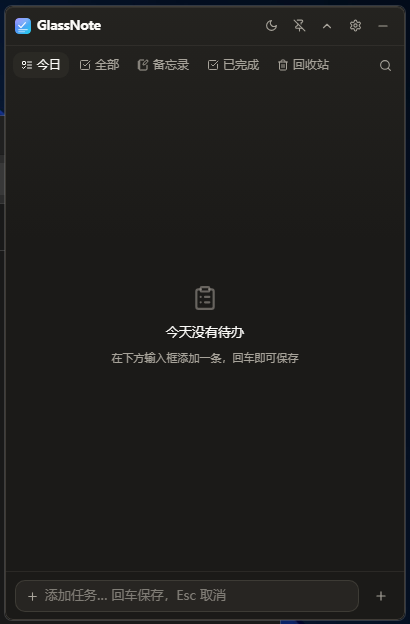
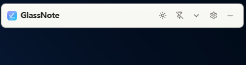

# GlassNote

轻量桌面便签（Windows）。任务 + 备忘录，存本地 SQLite，不联网。
暖中性 + 陶土橙配色，**只有白天 / 黑夜两套**，界面静态（无动画、无光斑、无噪音）。

| 白天 | 黑夜 | 折叠态 |
|---|---|---|
|  |  |  |

## 快速开始

```bash
# 开发
npm install
npm run tauri dev

# 打包安装包（产物在 src-tauri/target/release/bundle/）
npm run tauri build
```

前置：Node.js、Rust（要在 PATH 里）、Windows 10/11 + WebView2 运行时。

> 打包**必须**用 `npm run tauri build`，不要用 `cargo build --release`。
> 后者不会启用 `custom-protocol` feature，产物是「开发模式」二进制，
> 窗口里只会显示 `ERR_CONNECTION_REFUSED`。

Git Bash 用户在 MSVC 链接上有坑（`/usr/bin/link.exe` 抢了 MSVC 链接器），
用 `scripts/dev.sh` 包装好的脚本启动可以自动解决。

## 关键设计

**重复任务在库里只有一行**。`due_at` 永远指向「下一次出现的时间」，
完成时把它推进到下一次（按规则 `daily / weekly / monthly / weekday / every-N-days ...`），
完成事实记到 `completed_logs`（含推进前的 `due_at` 供撤销）。
「打勾后今天消失、明天回来」就是这自然成立的 —— 列表查询不需要「已完成实例」的概念。

**窗口不写在 `tauri.conf.json` 里**，由代码按需创建：
正常启动 → 创建并显示；开机自启 → 不创建、只留托盘；
关闭到托盘时销毁窗口（`releaseMemoryWhenHidden` 默认开），
常驻时只有 5 MB。

**窗口拖动走原生 `startDragging()`**。不靠 JS 逐帧 `setPosition`，
跟手程度与原生标题栏一致，JS 全程零参与。

**没有动态玻璃效果。** 配色就是当前的暖中性 + 陶土橙两套值，
面板下方是系统 Mica / Acrylic 背景，**不再有**光斑、噪点、鼠标跟随高光。
省 GPU 合成的同时换来了极度安静的外观（也避免「光斑时代」GPU 进程成为最大崩溃面）。

**窗口可见 + 空闲时 70.5 MB / 0.21% CPU**（启用 Chromium 单进程模式）。

## 资源占用

所有数字来自 `_setup/measure-resources.py`，30 秒窗口取平均：

| 状态 | 私有内存 | 空闲 CPU |
|---|---|---|
| 窗口可见 + 空闲 | **70.5 MB** | **0.21%** |
| 隐藏到托盘后（窗口销毁） | **5.2 MB** | **0.00%** |

70 MB 是 WebView2 进程模型的底线（即便合并成单进程仍有 browser + renderer
+ Chromium 运行时），要再降需换掉 Tauri、改用 Rust 原生 GUI —— 代价是重写整个前端，
对便签应用不划算。

单进程模式（`WEBVIEW2_FLAGS` 在 `commands/window.rs`）实测稳定：
8 分钟浸泡 16/16 通过，内存非单调波动无泄漏，端到端 IPC 链路正常。
若实际使用中遇到问题，把那个常量改成 `""` 即回退多进程（多花 26 MB）。

## 排错

**`npm run tauri dev` 后窗口是白屏**

最常见：Vite 默认 `host: "localhost"` 在 Node 17+ 解析成 `::1`、只监听 IPv6 回环，
而 WebView2 的 `localhost` 优先走 IPv4。已在 `vite.config.ts` 显式设 `host: "127.0.0.1"`，
两边不留歧义。

**`link: extra operand` / `LNK1181: 无法打开 kernel32.lib`**

Git Bash 把 `/usr/bin/link.exe`（coreutils 的硬链接工具）当成了 MSVC 链接器。
需要走 `vcvars64.bat` 把 `LIB` / `INCLUDE` 设好。`scripts/dev.sh` 自动处理，
或直接用「Developer PowerShell for VS 2022」。

**`link.exe returned an unexpected error`**

可能不是 dev 工具问题，而是 WebView2 配置目录被反复强杀污染了。
删掉整个 `%LOCALAPPDATA%\com.glassnote.desktop\EBWebView\`，重启即可。

**打包出来 9MB 体积 / 6.5GB 源码**

源码只 2 MB，剩下 6.5GB 全在 `src-tauri/target/`。`.gitignore` 已排除，
克隆后 `npm install` + `npm run tauri build` 即可。

## 已知限制

- **空闲内存 70MB 改不动**。WebView2 进程模型底线，再降只能换架构。
- **不开光斑、不开噪点、不开鼠标高光**。这是当前配色/设计的预期状态，不是 bug。
- **WebView2 配置目录反复强杀会污染**，需手动删 `EBWebView/`。
- **必须用 `npm run tauri build`**，不要用 `cargo build --release`。

更多实现细节（在改完之前）：`src-tauri/src/glass.rs`（Mica/Acrylic 探测）、
`src-tauri/src/recurrence.rs`（重复规则引擎）、`src/styles.css`（两套配色变量）。

## 许可证

[MIT](LICENSE) —— 可自由使用、修改、分发，包括商业用途；作者不承担任何担保责任。
